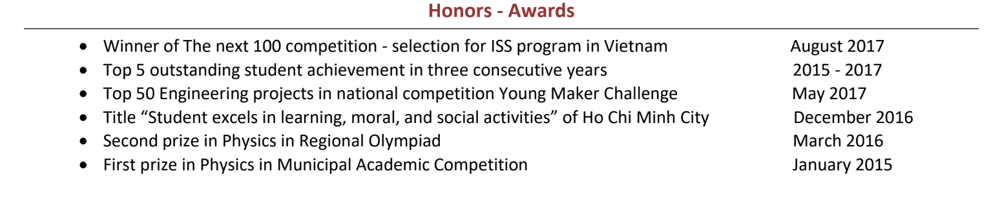

*Photo credit:*
`ThisIsEngineering <https://www.pexels.com/@thisisengineering?utm_content=attributionCopyText&utm_medium=referral&utm_source=pexels>`__\ *from*
`Pexels <https://www.pexels.com/photo/female-engineer-controlling-flight-simulator-3862132/?utm_content=attributionCopyText&utm_medium=referral&utm_source=pexels>`__

#######################################################
RESEARCH REPORT
#######################################################

*Editor: Nhâm Quân*

**Nội dung**

1. Tổng quan về Research Report

..

   1.1. Research Report là gì?

   1.2. Cấu trúc của Research Report

   1.3. Nội dung các mục chính trong Research Report

2. Hướng dẫn viết Research Report

..

   2.1. Chuẩn bị để viết Research Report

   2.2. Nội dung các mục chính (brainstorm outline)

2.3. Những tài nguyên minh họa (figures) trong Research Report

   2.4. Lời khuyên khi viết Research Report

3. Đọc thêm: Tiêu chuẩn APA (APA Style Essentials)

4. Ví dụ tham khảo

5. Về templates

**1. Tổng quan về Research Report**

**1.1. Research Report là gì?**

-  Một research paper/report là một bài viết có hệ thống về những phát hiện của một công trình nghiên cứu bao gồm các phương pháp thí nghiệm, bàn luận về kết quả, kết luận,...

-  Research report được viết theo văn phong học thuật. Ngôn ngữ của report có thể là tiếng Việt, tiếng Anh hoặc bất kỳ ngôn ngữ nào khác tùy vào đối tượng độc giả bạn nhắm tới, tuy nhiên toàn thể bài report nên thống nhất ngôn ngữ.

-  Bài viết này nhằm tổng hợp một cách dễ hiểu những cấu trúc, các bước cơ bản cũng như những điều cần lưu ý khi viết một bài report, để bạn có thể bắt đầu viết bài report đầu tiên của mình.

**1.2. Cấu trúc của Research Report**

**Bảng 1: Cấu trúc Report**

+--------------------+----------------------------------------------+
| **Các phần chính** | **Các mục chính**                            |
+====================+==============================================+
| Tổng quan          | Tựa đề (Title of report)                     |
+--------------------+----------------------------------------------+
|                    | Mục lục (Table of contents)                  |
+--------------------+----------------------------------------------+
|                    | Tóm tắt (Abstract/Synopsis)                  |
+--------------------+----------------------------------------------+
| Trọng tâm          | Đặt vấn đề (Introduction)                    |
+--------------------+----------------------------------------------+
|                    | Nghiên cứu liên quan (Literature Review)     |
|                    |                                              |
|                    | (có thể được gộp chung vào Introduction)     |
+--------------------+----------------------------------------------+
|                    | Phương pháp nghiên cứu (Methodology)         |
+--------------------+----------------------------------------------+
|                    | Kết quả (Results)                            |
+--------------------+----------------------------------------------+
|                    | Bàn luận (Discussion)                        |
+--------------------+----------------------------------------------+
|                    | Kết luận (Conclusion)                        |
+--------------------+----------------------------------------------+
|                    | Đề xuất (Recommendations)                    |
|                    |                                              |
|                    | (có thể gộp vào kết luận)                    |
+--------------------+----------------------------------------------+
| Tài liệu bổ sung   | Tài liệu tham khảo (References/Bibliography) |
+--------------------+----------------------------------------------+
|                    | Phụ lục (Appendices)                         |
+--------------------+----------------------------------------------+

**1.3. Các mục chính trong Research Report**

*(nội dung chi tiết của các mục chính trong report tìm ở phần hướng
dẫn)*

**Bảng 2: Các mục chính của report và minh họa**

+-----------------------+-----------------------+-----------------------+
| **Các**               | **Nội dung**          | **Hình ảnh minh họa** |
|                       |                       |                       |
| **mục chính**         | **sơ lược**           | :sup:`[1][2][3]`      |
+=======================+=======================+=======================+
| Title                 | Một tựa đề tóm tắt về | |image14|             |
|                       | tổng thể nghiên cứu   |                       |
| of report             |                       |                       |
+-----------------------+-----------------------+-----------------------+
| Table of              | Liệt kê hết tất cả    | |image15|             |
|                       | các mục/nội dung của  |                       |
| contents              | report                |                       |
+-----------------------+-----------------------+-----------------------+
| Abstract/             | Tóm tắt kết quả/kết   | |image16|             |
|                       | luận của nghiên cứu   |                       |
| Synopsis              | và phương pháp nghiên |                       |
|                       | cứu                   |                       |
+-----------------------+-----------------------+-----------------------+
| Introduc-             | Vấn đề nghiên cứu và  | |image17|             |
|                       | lý do tiến hành       |                       |
| tion                  | nghiên cứu            |                       |
+-----------------------+-----------------------+-----------------------+
| Literature            | Viết về một vài       | |image18|             |
|                       | nghiên cứu liên quan  |                       |
| Review                | lấy làm cơ sở lí luận | |image19|             |
|                       | hay cơ sở lý thuyết   |                       |
|                       |                       |                       |
|                       | Bạn cũng có thể trình |                       |
|                       | bày các định nghĩa    |                       |
|                       | mới, đặc điểm, số     |                       |
|                       | liệu và công cụ được  |                       |
|                       | sử dụng trong nghiên  |                       |
|                       | cứu của mình trong    |                       |
|                       | phần này.             |                       |
+-----------------------+-----------------------+-----------------------+
| Methodology           | Phương pháp tiến hành | |image20|             |
|                       | nghiên cứu, công cụ,  |                       |
|                       | nguyên liệu sử dụng,  |                       |
|                       | đối tượng nghiên cứu, |                       |
|                       | phương pháp đo lường, |                       |
|                       | phân tích dữ liệu...  |                       |
+-----------------------+-----------------------+-----------------------+
| Results               | Kết quả thu được sau  | |image21|             |
|                       | khi tiến hành thí     |                       |
|                       | nghiệm                |                       |
+-----------------------+-----------------------+-----------------------+
| Discussion            | Bàn luận về kết quả   | |image22|             |
|                       | nghiên cứu, kết quả   |                       |
|                       | đó liên quan như thế  |                       |
|                       | nào với những nghiên  |                       |
|                       | cứu liên quan khác,   |                       |
|                       | khái quát hóa, ý      |                       |
|                       | nghĩa hóa kết quả thu |                       |
|                       | được,...              |                       |
+-----------------------+-----------------------+-----------------------+
| Conclusion            | Tóm tắt kết quả thu   | |image23|             |
|                       | được                  |                       |
|                       |                       | |image24|             |
+-----------------------+-----------------------+-----------------------+
| Recommen-             | Đề xuất, hướng dẫn    |                       |
|                       | thêm về phương pháp   |                       |
| dations               | thí nghiệm để đạt     |                       |
|                       | được kết quả mong     |                       |
| (có thể gộp vào       | muốn.                 |                       |
| conclusion)           |                       |                       |
+-----------------------+-----------------------+-----------------------+
| Reference/            | Liệt kê tất cả tài    | |image25|             |
|                       | liệu đã tham khảo     |                       |
| Biblio-               |                       |                       |
|                       |                       |                       |
| graphy                |                       |                       |
+-----------------------+-----------------------+-----------------------+
| Appen-                | Danh mục tất cả các   | |image26|             |
|                       | tài liệu/ thông tin   |                       |
| dices                 | đi kèm được chỉ định  | |image27|             |
|                       | trong report (để làm  |                       |
|                       | rõ thêm một thông tin |                       |
|                       | nào đó trong report)  |                       |
+-----------------------+-----------------------+-----------------------+

**2. Hướng dẫn viết Research Report**

2.1. Lời khuyên khi chuẩn bị viết Research Report

**Khi nào thì bắt đầu viết Research Report?**

Càng sớm càng tốt! Không cần phải nghiên cứu xong mới bắt đầu viết, bạn
có thể:

-  **Bắt đầu viết report trước khi thực sự hoàn thành nghiên cứu**. Điều này giúp bạn quản lí được quá trình nghiên cứu tốt hơn, nhưng buộc bạn phải tư duy có hệ thống trong suốt quá trình nghiên cứu.

-  **Bắt đầu viết phần mở đầu (introduction) của report ngay khi có ý tưởng về vấn đề mà bạn muốn nghiên cứu**, sau đó có thể thay đổi bổ sung sau.

-  **Bắt đầu viết phần methodology ngay sau khi thiết kế thí nghiệm**, dù chưa thực sự tiến hành thí nghiệm và có kết quả. Tuy vậy, sau này bạn vẫn có thể sẽ phải sửa đổi và bổ sung nếu quá trình thí nghiệm có thay đổi.

-  **Bắt đầu viết phần kết quả (Results) dù chưa có kết quả hay chưa phân tích số liệu thu được.** Bằng cách thiết kế các tables và figures trước, bạn có thể định hướng được mình sẽ phân tích dữ liệu thu được như thế nào.

**Trước khi viết Research Report cần lưu ý những gì?**

Cần lưu ý các yếu tố sau:

-  **Mục đích của report này là gì?** Chẳng hạn như report cung cấp thông tin, phân tích sâu một vấn đề, diễn giải và thuyết phục về vấn đề, một bài đánh giá về một khảo sát, hay một bài review về kỹ thuật nào đó,...

-  **Ai là người sẽ đọc report này?** Nhiều báo cáo nghiên cứu bao gồm các thuật ngữ kỹ thuật. Trước khi bắt đầu viết báo cáo, hãy quyết định ai là độc giả của bạn, và tìm hiểu xem liệu họ có quen thuộc với các thuật ngữ kỹ thuật bạn định sử dụng hay không. Nếu bạn định sử dụng bất kỳ thuật ngữ kỹ thuật nào xa lạ với nhiều độc giả, hãy đưa ra lời giải thích về các thuật ngữ đó nhưng đừng bao gồm các giải thích chi tiết về các thuật ngữ kỹ thuật mà những người đọc báo cáo sẽ biết và hiểu chính xác.

-  **Chủ đề nghiên cứu của report là gì?**

-  **Công cụ bạn sẽ dùng để viết report là gì? Dùng phần mềm nào để viết report, thường là LaTeX hay MS Word, thì bạn cũng cần những kỹ năng cơ bản để có workflow thuận tiện. Bạn cũng có thể sử dụng những công cụ cộng tác như Overleaf, Papeeria, Google Docs,... để dễ dàng chia sẻ tiến độ công việc của mình với người khác.**

   -  **Hướng dẫn sử dụng LaTeX**

   -  **Overleaf, công cụ chỉnh sửa LaTeX trực tuyến**

-  **Số từ có bị hạn chế hay không, nếu có thì là bao nhiêu?**

-  **Định dạng yêu cầu của report là gì?** Chẳng hạn như APA Style, hay khi report viết cho journals thì cũng sẽ có yêu cầu khác.

Một số nguồn tham khảo thêm về phong cách viết các tài liệu học thuật:

https://www.adelaide.edu.au/writingcentre/resources/writing-resources#general-writing-guides

**2.2. Lên ý tưởng viết nội dung các mục chính**

Với bảng hướng dẫn dưới đây, bạn có thể lập dàn ý hay viết bản nháp cho
nội dung các phần của report.

**Bảng 3: Hướng dẫn viết nội dung Report**

+-----------------------------------------------------------------------+
| **Tựa đề - Title of report**                                          |
|                                                                       |
| -  Tựa đề thường mô tả chủ đề/vấn đề mà report hướng đến phân tích.   |
|                                                                       |
| ..                                                                    |
|                                                                       |
|    *Ví dụ: Ảnh hưởng của việc dùng đèn LED khi nuôi tảo*              |
|                                                                       |
| -  Đôi khi tựa đề tóm tắt kết quả thu được của nghiên cứu.            |
|                                                                       |
| ..                                                                    |
|                                                                       |
|    *Ví dụ: Nuôi tảo bằng đèn LED giúp nâng cao chất lượng sinh khối.* |
|                                                                       |
| -  Tựa đề tóm tắt ngắn gọn về các biến (độc lập hoặc không độc lập)   |
|       trong nghiên cứu.                                               |
|                                                                       |
| Ví dụ :sup:`[2]`                                                      |
|                                                                       |
| |image36|                                                             |
+=======================================================================+
| **Các tác giả - Authors**                                             |
|                                                                       |
| -  Tên tác giả được đặt bên dưới tiêu đề cùng với tên đại học hoặc    |
|       viện nghiên cứu.                                                |
|                                                                       |
| -  Tên tất cả những người đã tham gia vào nghiên cứu và viết report   |
|       được liệt kê ứng với tác giả chính (first author).              |
|                                                                       |
| -  Với các bài báo được xuất bản, những người có góp công nhỏ hơn cho |
|       nghiên cứu cũng được liệt kê là đồng tác giả. Nên hỏi ý kiến    |
|       của người hướng dẫn (mentor) trước khi liệt kê tên họ là đồng   |
|       tác giả.                                                        |
|                                                                       |
| Ví dụ :sup:`[2]`:                                                     |
|                                                                       |
| |image37|                                                             |
+-----------------------------------------------------------------------+
| **Tóm tắt - Abstract**                                                |
|                                                                       |
| -  Abstract là một đoạn dài 100-250 chữ, tóm tắt về mục tiêu, phương  |
|       pháp, kết quả, và kết luận của nghiên cứu.                      |
|                                                                       |
| Các nội dung cần có:                                                  |
|                                                                       |
| a. Xác định đối tượng nghiên cứu                                      |
|                                                                       |
| b. Làm rõ về thiết kế thí nghiệm                                      |
|                                                                       |
| c. Vật liệu sử dụng và phương pháp thí nghiệm                         |
|                                                                       |
| d. Tóm tắt kết quả bao gồm độ tin cậy của số liệu thống kê            |
|                                                                       |
| e. Đưa ra kết luận hay các so sánh từ kết quả thu được                |
|                                                                       |
| *Ví dụ xem ở bảng 2.*                                                 |
+-----------------------------------------------------------------------+
| **Mở đầu (Introduction)**                                             |
|                                                                       |
| Phần đặt vấn đề cần có những nội dung sau:                            |
|                                                                       |
| -  Định nghĩa các khái niệm: Định nghĩa hay làm rõ bất cứ cụm từ hay  |
|       lý thuyết được sử dụng một cách ngắn gọn, đơn giản hoặc chỉ một |
|       nghĩa nhất định.                                                |
|                                                                       |
| -  Sơ lược các nghiên cứu có liên quan (Literature Review): Đưa ra    |
|       những thông tin liên quan cần thiết để người đọc hiểu sơ lược   |
|       về nghiên cứu bằng cách liệt kê vài nghiên cứu khác trước đó và |
|       các tài liệu được sử dụng để dựng nên các giả thuyết khi tiến   |
|       hành thí nghiệm.                                                |
|                                                                       |
| -  Đặt vấn đề (Statement of the Problem): Giới thiệu chung về chủ đề  |
|       nghiên cứu.                                                     |
|                                                                       |
| -  Tính cấp thiết của vấn đề (Significance of the Problem): Nhận xét  |
|       vì sao vấn đề này cần được thí nghiệm/khảo sát.                 |
|                                                                       |
| -  Mục tiêu của nghiên cứu: Nghiên cứu này có thể giải quyết được vấn |
|       đề gì?                                                          |
|                                                                       |
| -  Giả thuyết (Statement of the Hypothesis): Đưa ra một khẳng         |
|       định/giả định để về vấn đề đang được nghiên cứu và kết quả có   |
|       thể nhận được.                                                  |
|                                                                       |
| -  Giả thiết (Assumptions): Đưa ra những giả thiết được đặt ra khi    |
|       tiến hành thí nghiệm.                                           |
|                                                                       |
| -  Những giới hạn (Limitations): Đưa ra các giới hạn trong tầm nghiên |
|       cứu của report, hoặc những gì có thể làm ảnh hưởng đến kết quả  |
|       của nghiên cứu, khiến kết quả giảm đi độ chính xác.             |
|                                                                       |
| *Ví dụ xem ở bảng 2.*                                                 |
+-----------------------------------------------------------------------+
| **Phương pháp nghiên cứu - Methodology**                              |
|                                                                       |
| Mô tả sơ bộ những gì bạn làm, làm như thế nào, và lúc nào.            |
|                                                                       |
| Một vài tiêu đề của phần này:                                         |
|                                                                       |
| a. Đối tượng thí nghiệm                                               |
|                                                                       |
| -  Đối tượng thí nghiệm là ai, là gì?                                 |
|                                                                       |
| ..                                                                    |
|                                                                       |
|    Nêu rõ các thông tin về đối tượng thí nghiệm.                      |
|                                                                       |
| -  Có bao nhiêu đối tượng thí nghiệm?                                 |
|                                                                       |
| ..                                                                    |
|                                                                       |
|    Nêu rõ số lượng đối tượng được thí nghiệm ứng với từng điều kiện   |
|    thí nghiệm. Nếu có bất cứ đối tượng nào ngừng thí nghiệm, nêu số   |
|    lượng và lý do.                                                    |
|                                                                       |
| -  Đối tượng được chọn lọc như thế nào?                               |
|                                                                       |
| ..                                                                    |
|                                                                       |
|    Nêu rõ đối tượng được chọn lọc thế nào, chia thành nhóm thế nào.   |
|                                                                       |
| b. Vật liệu sử dụng                                                   |
|                                                                       |
| ..                                                                    |
|                                                                       |
|    Liệt kê các vật liệu, thiết bị đã được sử dụng trong thí nghiệm.   |
|                                                                       |
|    Ví dụ :sup:`[2]`                                                   |
|                                                                       |
|    |image38|                                                          |
|                                                                       |
| c. Các bước tiến hành                                                 |
|                                                                       |
| -  Nêu rõ từng bước tiến hành thí nghiệm, điều kiện thí nghiệm,...    |
|                                                                       |
| -  Các bước chia nhóm kiểm soát (controlled group) và nhóm thử nghiệm |
|       (experimental group) phải được mô tả rõ ràng.                   |
|                                                                       |
| -  Các thủ tục như chọn ngẫu nhiên, đối trọng,... phải được mô tả chi |
|       tiết.                                                           |
|                                                                       |
| Ví dụ :sup:`[2]` (mô tả việc phân nhóm với điều kiện thí nghiệm khác  |
| nhau)                                                                 |
|                                                                       |
| |image39|                                                             |
+-----------------------------------------------------------------------+
| **Kết quả - Results**                                                 |
|                                                                       |
| -  Phần kết quả tóm tắt thông tin và số liệu thu được từ thí nghiệm.  |
|                                                                       |
| -  Đối chiếu kết quả với giả thuyết và đưa ra kết luận.               |
|                                                                       |
| Thông tin, số liệu thu được từ thí nghiệm có thể biểu diễn dưới 2     |
| dạng (đi kèm với mô tả):                                              |
|                                                                       |
| a. Tables (Bảng)                                                      |
|                                                                       |
| -  Dùng bảng để gói gọn các thông tin quan trọng của thí nghiệm một   |
|       cách có hệ thống.                                               |
|                                                                       |
| -  Không nên dùng bảng như một cách để mô tả kết quả, mà dùng những   |
|       mô tả để nó để nhấn mạnh các số liệu quan trọng trong bảng.     |
|                                                                       |
| -  Thông tin trong bảng phải thống nhất với thông tin được mô tả      |
|       (viết) trong report.                                            |
|                                                                       |
| -  Luôn đánh số cho mỗi bảng (ví dụ: Table 1) và ghi kèm số đó khi    |
|       bảng được nhắc đến trên văn bản - Nếu bảng nằm trong Phụ lục    |
|       thì bảng được đánh dấu bằng chữ in hoa (ví dụ: Table A).        |
|                                                                       |
| -  Bảng phải được đặt theo trình tự như thứ tự được nhắc đến trong    |
|       văn bản.                                                        |
|                                                                       |
| -  Phải có tên bảng và mô tả ngắn đặt bên dưới bảng.                  |
|                                                                       |
| ..                                                                    |
|                                                                       |
|    Ví dụ :sup:`[2]`:                                                  |
|                                                                       |
| |image40|                                                             |
|                                                                       |
| b. Figures (đa phần tương tự như phần table phía trên)                |
|                                                                       |
| -  Figures gồm đồ thị, biểu đồ và hình ảnh minh họa.                  |
|                                                                       |
| -  Tên được đặt ngay dưới figure. ‘Figure 1’ đặt trước tên figure.    |
|                                                                       |
| ..                                                                    |
|                                                                       |
|    Ví dụ :sup:`[2]`:                                                  |
|                                                                       |
| |image41|                                                             |
+-----------------------------------------------------------------------+
| **Bàn luận (Discussions)**                                            |
|                                                                       |
| -  Phần bàn luận nêu sơ kết quả thu được, và ý nghĩa của nó.          |
|                                                                       |
| -  Phần bàn luận phải nêu lại những nghiên cứu khác (literature) đã   |
|       viết trên phần mở đầu (Introduction), nhật xét xem kết quả thu  |
|       được có giống những kết quả của các nghiên cứu đó không, hay,   |
|       nếu chúng khác nhau, thì chúng khác nhau thế nào (và lý do bạn  |
|       nghĩ đã dẫn đến sự khác nhau đó). Cố gắng giải thích những điểm |
|       khác nhau đó bằng cách đưa ra những lý luận chứng minh tại sao  |
|       chúng diễn ra.                                                  |
|                                                                       |
| -  Đề xuất ý tưởng cho những nghiên cứu sau này trong cùng lĩnh vực,  |
|       những nghiên cứu sẽ dựa trên nghiên cứu của bạn và phát triển   |
|       nó.                                                             |
|                                                                       |
| -  Phần bàn luận nêu lên những lập luận quy nạp và suy luận của bạn   |
|       về thí nghiệm.                                                  |
|                                                                       |
| Lưu ý:                                                                |
|                                                                       |
| a. Tránh quan điểm cá nhân và những suy luận không phù hợp.           |
|                                                                       |
| b. Nhận thức về những thiếu sót và các biến không được kiểm soát      |
|       trong thí nghiệm của bạn. Dựa vào đó, tự đánh giá kết quả của   |
|       mình và đưa ra kết quả phù hợp, giải thích về các số liệu đó.   |
|                                                                       |
| c. Nêu rõ những biến giá trị mà bạn sẽ kiểm soát hay thay đổi trong   |
|       thí nghiệm tương lai để sửa chữa những sai lầm trong quá trình  |
|       nghiên cứu.                                                     |
|                                                                       |
| d. Đưa ra những ứng dụng thực tế của nghiên cứu, nếu có.              |
|                                                                       |
| *Ví dụ xem ở bảng 2.*                                                 |
+-----------------------------------------------------------------------+
| **Kết luận (Conclusions)**                                            |
|                                                                       |
| Phần này tóm gọn nội dung các phần trước, bao gồm kết quả thu được so |
| sánh với giả thuyết, và đề xuất cải tiến,...                          |
|                                                                       |
| Các nội dung cần có:                                                  |
|                                                                       |
| -  Nhắc lại thực trạng vấn đề (Restatement of the Problem)            |
|                                                                       |
| -  Mô tả phương pháp thiết kế thí nghiệm một cách ngắn gọn            |
|       (Description of the Procedures)                                 |
|                                                                       |
| -  Mô tả kết quả thu được (Major Findings): Kết quả thu được từ thí   |
|       nghiệm, những giả thuyết trước đó được nhắc lại, kết luận về    |
|       giả thuyết (đúng/sai) dựa trên kết quả thu được                 |
|                                                                       |
| -  Kết luận (Conclusion): Đưa ra những kết luận rút ra từ kết quả thu |
|       được.                                                           |
|                                                                       |
| -  Đề xuất (Recommendations for Further Investigation) : Từ kiến thức |
|       và kinh nghiệm thu được trong nghiên cứu trên, đưa ra đề xuất   |
|       làm thế nào để phát triển nghiên cứu này, hay những giả thuyết  |
|       nào cần được khảo sát thêm.                                     |
|                                                                       |
| Ví dụ :sup:`[2]`:                                                     |
|                                                                       |
| |image42|                                                             |
+-----------------------------------------------------------------------+
| **References/Bibliography**                                           |
|                                                                       |
| -  Nên được viết theo tiêu chuẩn APA (xem thêm ở phần đọc thêm)       |
|                                                                       |
| -  Là bản liệt kê tất cả các tài liệu được sử dụng trong quá trình    |
|       nghiên cứu, những tài liệu đó phải được publicly available.     |
|                                                                       |
| -  Tài liệu sử dụng phải được đề cập ngay trong nội dung của report,  |
|       và trong list tài liệu tham khảo cũng phải có đánh dấu xem tài  |
|       liệu đó được nằm ở vị trí nào trong report.                     |
|                                                                       |
| -  Một tài liệu được liệt kê theo cú pháp sau - tên tác giả, ngày     |
|       công bố, tên của nghiên cứu.                                    |
|                                                                       |
| Ví dụ :sup:`[2]`                                                      |
|                                                                       |
| |image43|                                                             |
|                                                                       |
| **\*Tham khảo thêm APA Style Essential ở phần phụ lục**               |
+-----------------------------------------------------------------------+
| **Appendix**                                                          |
|                                                                       |
| Phụ lục bao gồm bất cứ bảng, bảng số liệu thống kê, đồ thị, biểu mẫu, |
| hay những tài liệu không trực tiếp liên quan đến quá trình thí nghiệm |
| nhưng cần thiết đưa vào trong report.                                 |
+-----------------------------------------------------------------------+

2.3. Những tài nguyên minh họa (figures) trong Research Report

- Khi viết report, bạn có thể muốn thêm những hình ảnh, đồ thị, giản đồ để giới thiệu hay giải thích những định nghĩa, công cụ thực hiện, phương pháp thực hiện, v.v... 

- Vì bài viết chỉ để giới thiệu cơ bản về Research Report nên mình sẽ không đi sâu vào phần minh họa, 
   -  Trích dẫn figures từ các nguồn: bạn cần trích dẫn nguồn bằng các định dạng phổ biến.
   -  Tự thiết kế figures: bạn có thể dùng những công cụ xử lý số liệu như Excel, Python,... để tạo ra những đồ thị minh họa phù hợp và bắt mắt, hay dùng những công cụ vẽ như Adobe Illustrator, Inkscape,... để thiết kế những giản đồ trực quan giúp người đọc dễ hình dung hơn.

**2.4. Lời khuyên khi viết Research Report**

**Về nội dung:**

**Bảng 4: Lời khuyên khi viết Research Report**

+-----------------------------------+-----------------------------------+
| Phần                              | Lời khuyên                        |
+===================================+===================================+
| Abstract                          | Abstract là phần quan trọng nhất  |
|                                   | vì việc đọc abstract cho biết     |
|                                   | report có chứa đựng thông tin mà  |
|                                   | người đọc tìm kiếm hay không. Vậy |
|                                   | nên:                              |
|                                   |                                   |
|                                   | -  **Viết phần abstract cuối      |
|                                   |       cùng**.                     |
|                                   |                                   |
|                                   | -  **Ngắn gọn, súc tích và đầy đủ |
|                                   |       thông tin** theo thứ tự     |
|                                   |       *(xem bảng 3)*              |
|                                   |                                   |
|                                   | -  **Chú ý giới hạn số từ** **khi |
|                                   |       viết**.                     |
|                                   |                                   |
|                                   | ..                                |
|                                   |                                   |
|                                   |    Nếu lỡ viết abstract dài quá   |
|                                   |    giới hạn số từ, thì đầu tiên   |
|                                   |    xóa một vài thông tin về thông |
|                                   |    tin chung về chủ đề            |
|                                   |    (background information), sau  |
|                                   |    đó xóa một vài bước tiến hành  |
|                                   |    thí nghiệm không cần thiết.    |
+-----------------------------------+-----------------------------------+
| Introduction                      | -  **Sử dụng background           |
|                                   |       information có chọn lọc**.  |
|                                   |       (thông tin chung về chủ đề  |
|                                   |       liên quan đến nghiên cứu).  |
|                                   |                                   |
|                                   | ..                                |
|                                   |                                   |
|                                   |    Những thông tin không cần      |
|                                   |    thiết thường hoặc là điều mà   |
|                                   |    ai cũng biết hoặc không cần    |
|                                   |    thiết khi tìm hiểu về report.  |
|                                   |                                   |
|                                   | -  **Đặt câu hỏi nghiên cứu       |
|                                   |       (research questions) gần    |
|                                   |       đầu report** để người đọc   |
|                                   |       hiểu được mục đích tiến     |
|                                   |       hành nghiên cứu. Không đặt  |
|                                   |       câu hỏi nghiên cứu ở cuối   |
|                                   |       đoạn văn mở đầu, không đặt  |
|                                   |       sau phương pháp thí nghiệm  |
|                                   |       (research method), hay sau  |
|                                   |       kết quả thu được.           |
|                                   |                                   |
|                                   | -  **Đặt câu hỏi nghiên cứu với   |
|                                   |       ngôn từ đơn giản, dễ        |
|                                   |       hiểu.** Chỉ sử dụng các     |
|                                   |       thuật ngữ kỹ thuật khi thật |
|                                   |       cần thiết.                  |
|                                   |                                   |
|                                   | -  **Câu hỏi nghiên cứu phải      |
|                                   |       chính xác**, phải là vấn đề |
|                                   |       mà nghiên cứu trong report  |
|                                   |       có thể chứng minh. Đừng đặt |
|                                   |       câu hỏi nghiên cứu quá bay  |
|                                   |       bổng, hay hàm chứa nhiều    |
|                                   |       thông tin mà kết luận từ    |
|                                   |       nghiên cứu không bao hàm.   |
|                                   |                                   |
|                                   | Tham khảo thêm cách viết:         |
|                                   | http://libguides.astate.edu/c.php |
|                                   | ?g=14501&p=78098                  |
+-----------------------------------+-----------------------------------+
| Method                            | -  **Mở đầu bằng việc giải thích  |
|                                   |       về logic của thiết kế thí   |
|                                   |       nghiệm**. Chưa mô tả chi    |
|                                   |       tiết về phương pháp cho đến |
|                                   |       khi bạn vạch ra quy trình   |
|                                   |       chung và giải thích làm thế |
|                                   |       nào nó có thể sẽ trả lời    |
|                                   |       các câu hỏi nghiên cứu mà   |
|                                   |       bạn đã nêu trong phần giới  |
|                                   |       thiệu.                      |
|                                   |                                   |
|                                   | -  **Chỉ liệt kê các chi tiết     |
|                                   |       quan trọng**. Report nên    |
|                                   |       bao gồm các chi tiết có thể |
|                                   |       tạo ra sự khác biệt đáng kể |
|                                   |       trong kết quả.              |
|                                   |                                   |
|                                   | -  **Hãy cân nhắc cần bao nhiêu   |
|                                   |       chi tiết để trong việc mô   |
|                                   |       tả các bước tiến hành       |
|                                   |       nghiên cứu**. Report của    |
|                                   |       bạn nên bao gồm các chi     |
|                                   |       tiết mà người đọc sẽ cần để |
|                                   |       tiến hành một nghiên cứu    |
|                                   |       tương tự. Mô tả các khía    |
|                                   |       cạnh khác biệt trong nghiên |
|                                   |       cứu và quy trình của bạn.   |
|                                   |       Để report dễ đọc, bạn có    |
|                                   |       thể bao gồm một mô tả ngắn  |
|                                   |       gọn, chung về các quy trình |
|                                   |       trong phần thân của report  |
|                                   |       và trình bày chi tiết trong |
|                                   |       phần phụ lục.               |
|                                   |                                   |
|                                   | -  **Nếu bạn thay đổi bất kỳ biến |
|                                   |       nào, hãy giải thích tại     |
|                                   |       sao**.                      |
+-----------------------------------+-----------------------------------+
| Results                           | -  **Đặt kết quả quan trọng nhất  |
|                                   |       lên phía trước.** Bắt đầu   |
|                                   |       với kết quả trả lời trực    |
|                                   |       tiếp các câu hỏi nghiên     |
|                                   |       cứu. Sau đó, hãy trình bày  |
|                                   |       kết quả của các phân tích   |
|                                   |       khác hỗ trợ các kết quả     |
|                                   |       chính.                      |
|                                   |                                   |
|                                   | -  **Hãy cân nhắc những số liệu   |
|                                   |       thống kê sẽ liệt kê.** Khi  |
|                                   |       hoàn thành phân tích dữ     |
|                                   |       liệu, bạn có thể sẽ có      |
|                                   |       nhiều số liệu thống kê để   |
|                                   |       ghi trong report hơn những  |
|                                   |       gì độc giả muốn biết về     |
|                                   |       nghiên cứu của bạn. Tuy     |
|                                   |       nhiên, liệt kê quá nhiều    |
|                                   |       thông tin thống kê sẽ khiến |
|                                   |       report quá dài, mọi người   |
|                                   |       sẽ không đọc nó. (Nếu báo   |
|                                   |       cáo của bạn quá dài vì      |
|                                   |       nghiên cứu của bạn đã cố    |
|                                   |       gắng trả lời một số câu hỏi |
|                                   |       nghiên cứu, bạn có thể cần  |
|                                   |       phải viết hai hoặc nhiều    |
|                                   |       báo cáo riêng biệt.)        |
|                                   |                                   |
|                                   | -  **Thêm bảng và biểu đồ** giúp  |
|                                   |       biểu thị các kết quả quan   |
|                                   |       trọng của nghiên cứu, dễ    |
|                                   |       dàng tìm thấy thông tin bổ  |
|                                   |       sung mà độc giả cần. Khi    |
|                                   |       tạo biểu đồ hoặc bảng, hãy  |
|                                   |       sử dụng tiêu đề để cung cấp |
|                                   |       cho người đọc đủ thông tin  |
|                                   |       để hiểu chúng mà không cần  |
|                                   |       nhìn vào văn bản. Ngược     |
|                                   |       lại, khi viết phần kết quả, |
|                                   |       tóm tắt ngắn gọn bằng từ    |
|                                   |       ngữ những gì mỗi bảng và    |
|                                   |       mỗi biểu đồ hiển thị và kết |
|                                   |       quả quan trọng một cách rõ  |
|                                   |       ràng sao cho người đọc      |
|                                   |       không cần nhìn vào bất kỳ   |
|                                   |       bảng và biểu đồ.            |
+-----------------------------------+-----------------------------------+
| Discussion                        | -  **Mở đầu phần thảo luận bằng   |
|                                   |       cách lặp lại các câu hỏi    |
|                                   |       nghiên cứu**, sau mỗi câu   |
|                                   |       hỏi với một mô tả ngắn gọn  |
|                                   |       về các kết quả có liên      |
|                                   |       quan. Đối với một số câu    |
|                                   |       hỏi nghiên cứu, kết quả của |
|                                   |       bạn có thể không ngụ ý rõ   |
|                                   |       ràng câu trả lời. Nếu điều  |
|                                   |       đó xảy ra, hãy giải thích   |
|                                   |       tại sao kết quả của bạn     |
|                                   |       không trả lời câu hỏi.      |
|                                   |                                   |
|                                   | -  **Chỉ ra những hạn chế của     |
|                                   |       nghiên cứu của bạn**, để    |
|                                   |       độc giả biết rằng bạn nhận  |
|                                   |       thức được những thiếu sót   |
|                                   |       trong nghiên cứu cũng như   |
|                                   |       những điểm mạnh của nó.     |
|                                   |                                   |
|                                   | -  **Kết luận bằng cách giải      |
|                                   |       thích tầm quan trọng của    |
|                                   |       nghiên cứu**. Ý nghĩa thực  |
|                                   |       tế của kết quả của bạn là   |
|                                   |       gì? Ai có thể sử dụng thông |
|                                   |       tin mà nghiên cứu của bạn   |
|                                   |       cung cấp?                   |
+-----------------------------------+-----------------------------------+
| Conclusion                        | Tham khảo thêm cách viết:         |
|                                   |                                   |
|                                   | https://libguides.usc.edu/writing |
|                                   | guide/conclusion                  |
+-----------------------------------+-----------------------------------+

**Về phong cách viết và dùng từ:**

-  Tránh câu dài: Chia mỗi câu dài (35 từ hoặc dài hơn) thành hai hoặc nhiều câu ngắn.

-  Đại từ nhân xưng ngôi thứ nhất như tôi và chúng tôi hiện được phép viết trong văn bản học thuật.

-  Tránh sử dụng câu bị động.

Tham khảo thêm lời khuyên khi viết research report:

https://www.ets.org/Media/Research/pdf/RM-12-05.pdf

**3. Đọc thêm: Các tiêu chuẩn** **trích dẫn** **khi viết Research
Report**

**3.1. Tiêu chuẩn APA (APA Style Essentials)**

-  American Psychology Association (APA) là một tổ chức chuyên nghiệp đại diện cho các nhà tâm lý học tại Hoa Kỳ.

-  Chuẩn APA là một tập hợp các quy tắc được tạo ra nhằm giúp cho việc viết và trích dẫn nguồn viết, một **định dạng** giúp ngăn chặn hiện tượng đạo văn và để tác giả chính biết về thông tin được sử dụng. Nó cũng dùng để cung cấp định dạng trích dẫn được chuẩn hoá và súc tích cho các bài viết (ví dụ: bài luận, bài nghiên cứu, bài phê bình…).

   -  Link download bản dịch Tiếng Việt (đã rút gọn):

   -  Link download bản tóm tắt về APA Style (nằm ở phần 13.5)

   -  

3.2. Tiêu chuẩn MLA

-  Modern Language Association (MLA) là một tổ chức chuyên nghiệp đại diện cho các nhà nghiên cứu ngôn ngữ và văn học.

-  Chuẩn MLA, tương tự như chuẩn APA, được dùng để ngăn chặn hiện tượng đạo văn trong các bài nghiên cứu về văn học và nghệ thuật. Chuẩn nào nên được sử dụng, như vậy, tùy vào ngành mà Research Report của bạn nghiên cứu.

..

   Link download bản tóm tắt về MLA Handbook, cuốn sách nền tảng quy
   định chuẩn MLA

**4. Ví dụ tham khảo**

:sup:`[1]` http://web.mit.edu/course/21/21.guide/rep-resc.htm

:sup:`[2]`
https://www.sciencedirect.com/science/article/pii/S0960852418301445

:sup:`[3]` https://core.ac.uk/download/pdf/35461197.pdf

**5. Về templates**

Các loại template liên quan đến nghiên cứu khoa học nên làm:

-  Research report

-  Lab report

-  Scientific poster

-  Science brochure

.. |image0| image:: media/image22.gif
   :width: 3.67632in
   :height: 4.21354in
.. |image1| image:: media/image9.gif
   :width: 3.96969in
   :height: 3.77604in
.. |image2| image:: media/image1.gif
   :width: 3.94792in
   :height: 2.29167in
.. |image3| image:: media/image2.gif
   :width: 3.91146in
   :height: 1.99824in
.. |image4| image:: media/image4.gif
   :width: 3.98438in
   :height: 1.44281in
.. |image5| image:: media/image14.gif
   :width: 3.97396in
   :height: 5.40193in
.. |image6| image:: media/image10.gif
   :width: 3.93229in
   :height: 5.26527in
.. |image7| image:: media/image21.gif
   :width: 3.93229in
   :height: 3.70354in
.. |image8| image:: media/image5.gif
   :width: 3.94271in
   :height: 4.37837in
.. |image9| image:: media/image13.gif
   :width: 3.98438in
   :height: 0.86712in
.. |image10| image:: media/image15.gif
   :width: 3.93229in
   :height: 2.3059in
.. |image11| image:: media/image8.png
   :width: 3.91146in
   :height: 1.38761in
.. |image12| image:: media/image16.png
   :width: 3.97917in
   :height: 1.34722in
.. |image13| image:: media/image20.png
   :width: 3.97917in
   :height: 5.84722in

.. |image15| image:: media/image9.gif
   :width: 3.96969in
   :height: 3.77604in
.. |image16| image:: media/image1.gif
   :width: 3.94792in
   :height: 2.29167in
.. |image17| image:: media/image2.gif
   :width: 3.91146in
   :height: 1.99824in
.. |image18| image:: media/image4.gif
   :width: 3.98438in
   :height: 1.44281in
.. |image19| image:: media/image14.gif
   :width: 3.97396in
   :height: 5.40193in
.. |image20| image:: media/image10.gif
   :width: 3.93229in
   :height: 5.26527in
.. |image21| image:: media/image21.gif
   :width: 3.93229in
   :height: 3.70354in
.. |image22| image:: media/image5.gif
   :width: 3.94271in
   :height: 4.37837in
.. |image23| image:: media/image13.gif
   :width: 3.98438in
   :height: 0.86712in
.. |image24| image:: media/image15.gif
   :width: 3.93229in
   :height: 2.3059in
.. |image25| image:: media/image8.png
   :width: 3.91146in
   :height: 1.38761in
.. |image26| image:: media/image16.png
   :width: 3.97917in
   :height: 1.34722in
.. |image27| image:: media/image20.png
   :width: 3.97917in
   :height: 5.84722in
.. |image28| image:: media/image12.png
   :width: 6.11458in
   :height: 0.54167in
.. |image29| image:: media/image11.png
   :width: 6.11458in
   :height: 0.90104in
.. |image30| image:: media/image18.png
   :width: 5.375in
   :height: 1.10417in
.. |image31| image:: media/image19.png
   :width: 6.11458in
   :height: 3.54167in
.. |image32| image:: media/image6.png
   :width: 6.11458in
   :height: 2.13889in
.. |image33| image:: media/image3.png
   :width: 6.11369in
   :height: 3.00521in
.. |image34| image:: media/image17.png
   :width: 5.47917in
   :height: 2.55208in
.. |image35| image:: media/image7.png
   :width: 6.04472in
   :height: 2.14063in
.. |image36| image:: media/image12.png
   :width: 6.11458in
   :height: 0.54167in
.. |image37| image:: media/image11.png
   :width: 6.11458in
   :height: 0.90104in
.. |image38| image:: media/image18.png
   :width: 5.375in
   :height: 1.10417in
.. |image39| image:: media/image19.png
   :width: 6.11458in
   :height: 3.54167in
.. |image40| image:: media/image6.png
   :width: 6.11458in
   :height: 2.13889in
.. |image41| image:: media/image3.png
   :width: 6.11369in
   :height: 3.00521in
.. |image42| image:: media/image17.png
   :width: 5.47917in
   :height: 2.55208in
.. |image43| image:: media/image7.png
   :width: 6.04472in
   :height: 2.14063in
